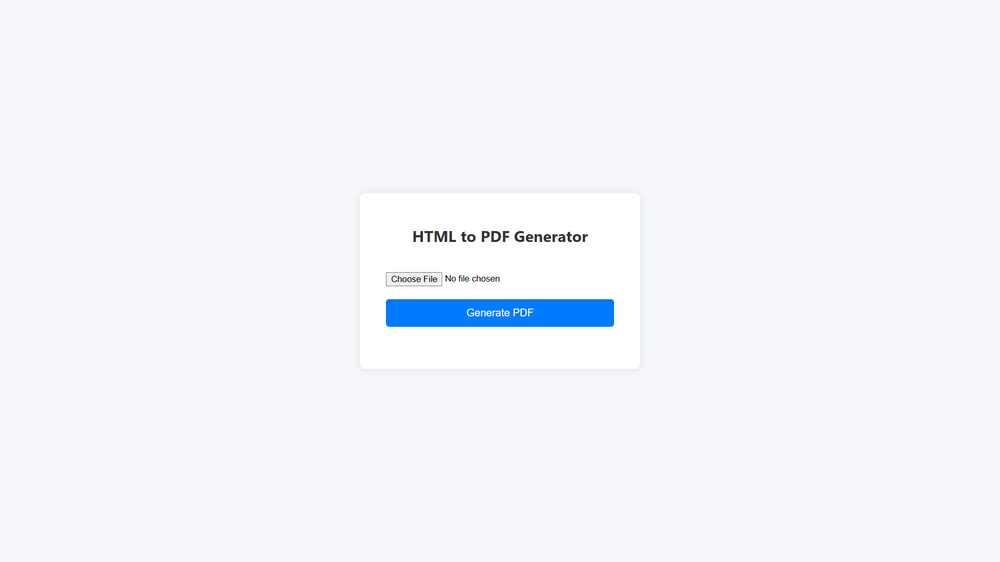

# Html_To_PDF

# HTML to PDF Generator

## Task Description
This project allows users to upload an HTML file and converts it into a downloadable PDF file. The conversion is done on the server-side using `pdfkit` and `wkhtmltopdf`.

## Important Dependency
- This project requires **wkhtmltopdf** to be installed on your system as it is used by `pdfkit` to convert HTML to PDF.
- You can download **wkhtmltopdf** from the official website:  
  [https://wkhtmltopdf.org/downloads.html](https://wkhtmltopdf.org/downloads.html)  
- After installing, make sure the `wkhtmltopdf` executable is accessible in your system PATH.

## Screenshots

### 1. Homepage

### 2. Input HTML File

### 3. Output PDF File
[Screenshot of Sample PDF](output/2_image.png)

## Widget / Algorithm Used
- The frontend uses a simple HTML form with a file input and a "Generate PDF" button.
- JavaScript handles file upload and sends it to the backend via a POST request, including CSRF token handling.
- The backend Django view reads the uploaded HTML file, uses `pdfkit` (which requires `wkhtmltopdf` installed) to convert HTML content to PDF bytes, and returns the PDF file as a response for download.
